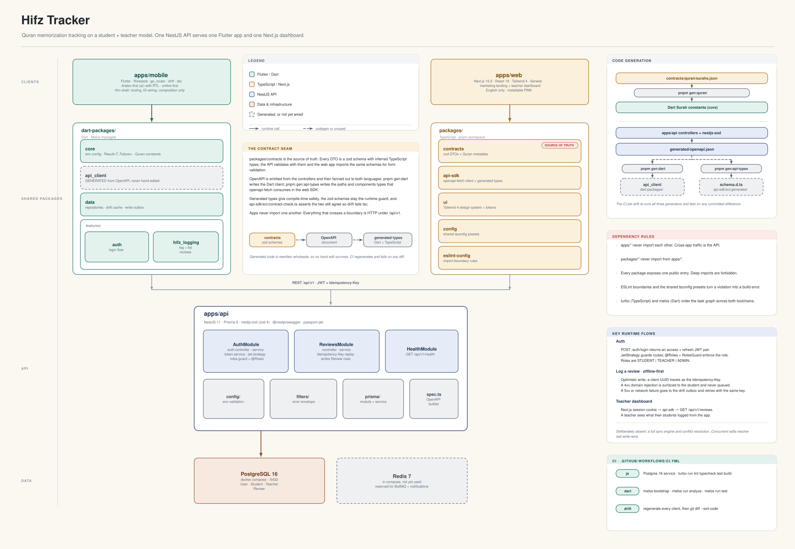
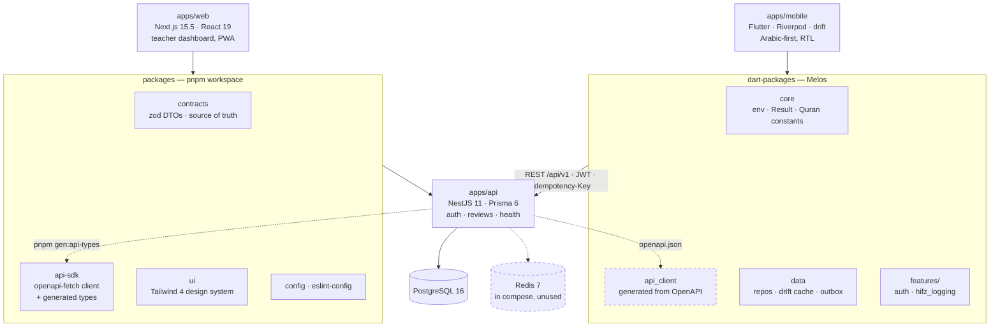
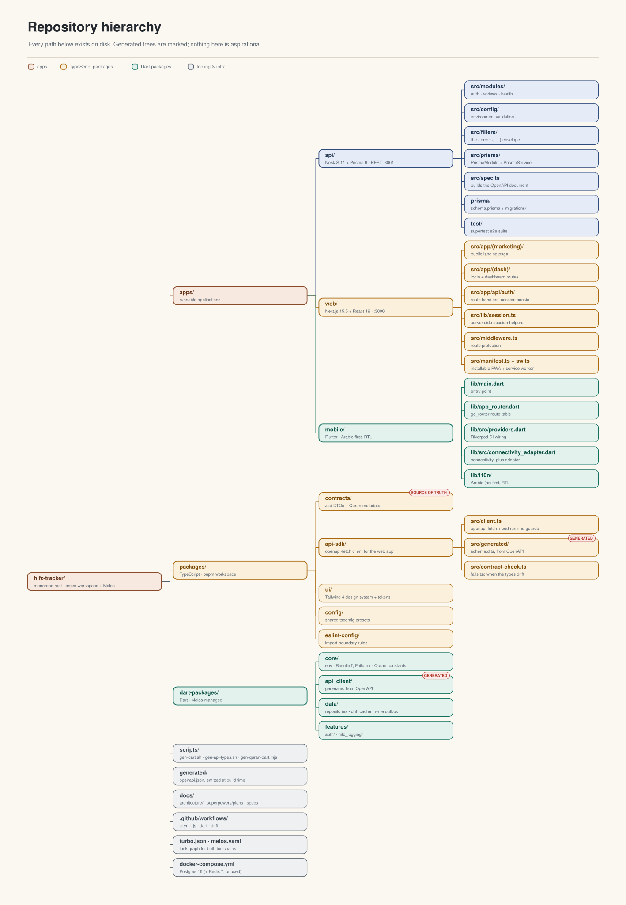
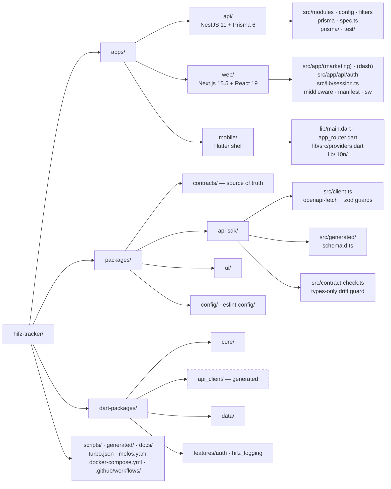

# Architecture diagrams

Visual maps of the system and the repository. Every box, path, and module name here was read off
the working tree — nothing is aspirational.

| File | What it is |
| --- | --- |
| [`index.html`](index.html) | Both diagrams in one page, with the SVGs inlined. No network, no build. |
| [`hifz-tracker-architecture.excalidraw`](hifz-tracker-architecture.excalidraw) | Editable source for the system diagram. |
| [`hifz-tracker-architecture.svg`](hifz-tracker-architecture.svg) / [`.png`](hifz-tracker-architecture.png) | Rendered system diagram. |
| [`repo-structure.excalidraw`](repo-structure.excalidraw) | Editable source for the repository tree. |
| [`repo-structure.svg`](repo-structure.svg) / [`.png`](repo-structure.png) | Rendered repository tree. |
| [`tools/`](tools/) | Generators. `draw.mjs` holds the shared geometry layer; `arch.mjs` and `tree.mjs` describe each scene. |

## Viewing

Open `index.html` in a browser, or drag either `.excalidraw` file onto
[excalidraw.com](https://excalidraw.com). The Excalidraw files are plain JSON scenes, so they stay
diffable in git and can be edited by hand if you prefer.

## Diagram 1 — system architecture

Clients on top, the code they share beneath them, everything converging on one API over REST. The
right rail spells out code generation, the dependency rules, the three runtime flows that matter,
and CI.





### The contract seam

`packages/contracts` holds every DTO as a zod schema with inferred TypeScript types. The API
validates with those schemas and the web app imports the same ones for form validation, so nothing
is duplicated inside TypeScript.

OpenAPI is emitted from the controllers and fanned out across the language boundary. `pnpm gen:dart`
writes `dart-packages/api_client`; `pnpm gen:api-types` writes the `paths` and `components` types
that `openapi-fetch` consumes in `packages/api-sdk`. So generated code covers compile time, the zod
schemas stay the runtime guard, and `packages/api-sdk/src/contract-check.ts` is a types-only module
asserting the generated schema still extends the contracts types — drift fails `tsc`, not prod.

The `drift` CI job regenerates all three generators and runs `git diff --exit-code` over
`dart-packages/` and `packages/api-sdk/src/generated/`.

## Diagram 2 — repository hierarchy





## Regenerating

The SVG and Excalidraw outputs are emitted by the same geometry layer in
[`tools/draw.mjs`](tools/draw.mjs), so the two formats cannot drift apart. The generators have no
dependencies beyond Node, and `raster.mjs` needs one optional dev dependency for PNG rendering:

```bash
cd docs/architecture/tools

node arch.mjs     # system diagram   -> .excalidraw + .svg
node tree.mjs     # repository tree  -> .excalidraw + .svg
node html.mjs     # inline both SVGs into ../index.html

pnpm add -D -w @resvg/resvg-js
node raster.mjs   # .svg -> .png, at 2x and 1.6x
```

Both scenes are deterministic: re-running produces byte-identical SVG. There is no drift check on
these files, so if you edit a `.excalidraw` by hand in Excalidraw, export the SVG and PNG yourself
rather than re-running the generators, or your hand edits will be overwritten.
